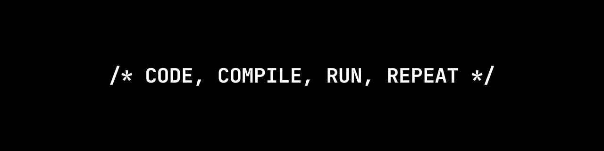

# Welcome

## About Me :man_technologist:

I'm Kaloyan, a passionate developer and lifelong learner, currently pursuing a computer science degree at Sofia University. My love for problem-solving and creating meaningful solutions led me to the fascinating world of software development.

I enjoy working on a variety of projects, from console applications to web applications and beyond. This diversity keeps me engaged and constantly motivated to learn and explore new technologies and frameworks.

## GitHub Stats :chart_with_upwards_trend:

## My Tech Stack :briefcase:

- **Programming Languages**: C++, Java, Swift, Prolog, Haskell, Scheme
- **Front-end**: HTML, CSS, JavaScript, Angular
- **Back-end**: PHP, Go
- **Databases**: MariaDB, PostgreSQL
- **Tools**: Visual Studio Code, IntelliJ IDEA, Xcode, XAMPP, Postman
- **Version Control**: Git

## Featured Projects :sparkles:

Here are some of the projects I'm proud of:

1. [Crypto Wallet](https://github.com/kaloyandimov/crypto-wallet): Manage your cryptocurrency investments and track your portfolio.

2. [Nondeterministic Finite Automaton](https://github.com/kaloyandimov/nondeterministic-finite-automaton): Create, manipulate, and explore nondeterministic finite automata.

3. [City Map](https://github.com/kaloyandimov/city-map): Navigate, analyze, and uncover various aspects of a city.

Feel free to explore these projects and provide feedback or suggestions!

## Get in Touch :handshake:

I'm always eager to connect with fellow developers, tech enthusiasts, or anyone interested in the projects I'm working on. Don't hesitate to reach out to me via [email](mailto:kaloyandimov99@gmail.com) or connect with me on [LinkedIn](https://www.linkedin.com/in/kaloyandimov/) to start a conversation. Let's collaborate and create amazing things together!
